# Sequence Diagrams — YusBuild (repository-visible behavior)

This file uses **Mermaid** to visualize major interaction sequences supported by the codebase.

Legend:
- **Verified Sequences**: directly supported by concrete code paths and/or tests.
- **Inferred Sequences**: strongly implied by architecture but not expressed in a single explicit code path.
- **Recommendations**: none (this document is strictly behavioral).

---

## Verified Sequences

### 1) Authentication: Obtain JWT token

**Purpose**
Authenticate a user and receive JWT access+refresh tokens.

**Actors**
User, API View, Serializer/Controller, Model, Database

**Preconditions**
User credentials are valid.

**Sequence Diagram**
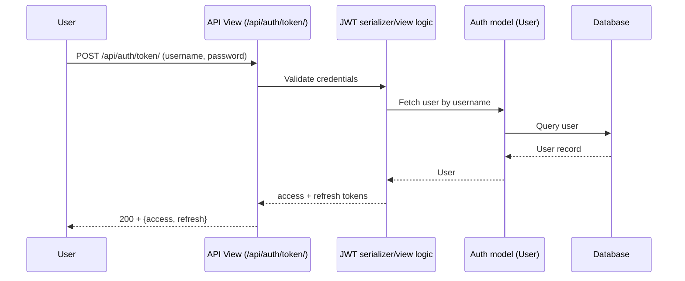

**Notes**
- Token endpoints are registered in `config/urls.py`.

---

### 2) JWT Refresh

**Purpose**
Exchange a refresh token for a new access token.

**Actors**
User, API View, JWT logic

**Preconditions**
Refresh token is valid.

**Sequence Diagram**
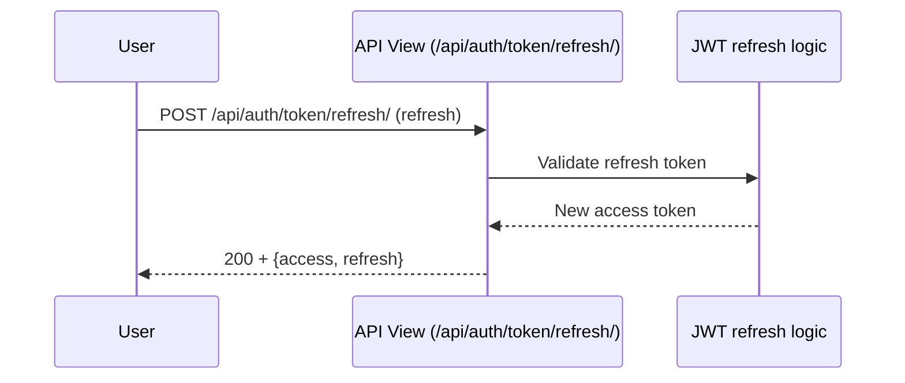

**Notes**
- Endpoint is registered in `config/urls.py`.

---

### 3) Operational Health Check

**Purpose**
Return a lightweight liveness payload.

**Actors**
User, API View, JsonResponse

**Preconditions**
None.

**Sequence Diagram**
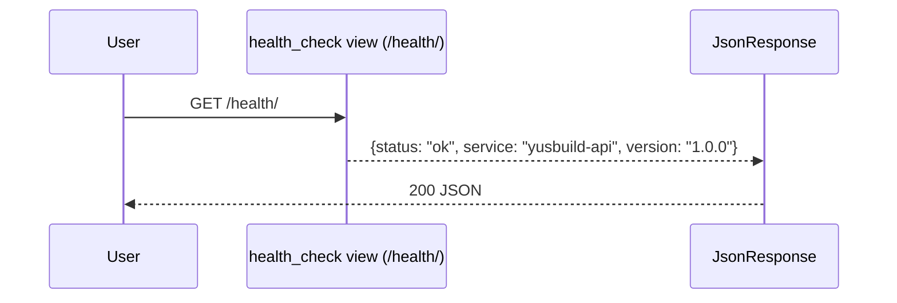

**Notes**
- `apps/common/views.py::health_check`.

---

### 4) Operational Readiness Check

**Purpose**
Verify database connectivity and migration check before reporting readiness.

**Actors**
User, API View, Database, Management command (migrate --check)

**Preconditions**
Database should be reachable.

**Sequence Diagram**
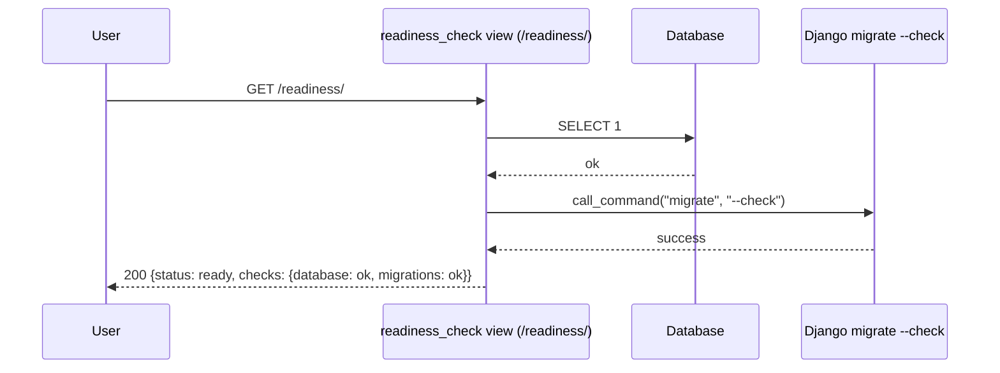

**Notes**
- On exceptions, returns 503 and sets `database` / `migrations` checks to `error`.

---

### 5) Project Creation (plus membership)

**Purpose**
Create a project and attach creator membership with an inferred role.

**Actors**
User, Project API View, Project Serializer, Project Model, ProjectMembership Model, Database

**Preconditions**
User is authorized by permission + group logic.

**Sequence Diagram**
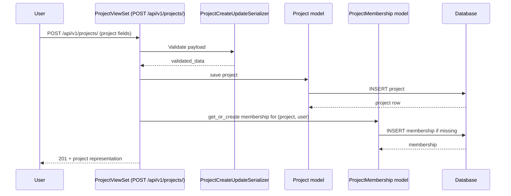

**Notes**
- Role inference is implemented in `apps/projects/views.py::perform_create`.

---

### 6) Pile Creation (auto-calculate + snapshot history)

**Purpose**
Create a pile and persist calculated results + immutable history.

**Actors**
User, Pile API View, Pile Serializer, PileCalculator, Persistence helpers/Services, Pile models, Calculation history models

**Preconditions**
Target project is visible/writable for the user.

**Sequence Diagram**
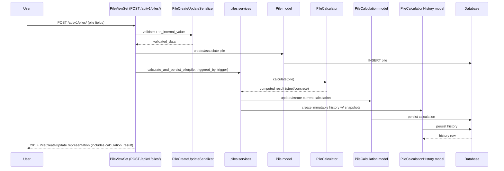

**Notes**
- View delegates persistence to serializer + `apps/piles/services.py`.
- History `trigger == "create"` is asserted in `tests/test_api.py`.

---

### 7) Pile Update (recalculate when quantity inputs change)

**Purpose**
Update pile attributes and recalculate quantities when relevant fields change.

**Actors**
User, Pile API View, Pile Serializer, piles services, History model

**Preconditions**
User has write permission and pile is visible.

**Sequence Diagram**
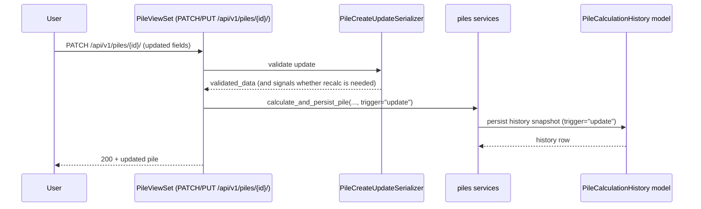

**Notes**
- Tests assert history trigger is `"update"` when `actual_length_m` is modified.

---

### 8) Force Recalculation

**Purpose**
Recompute a pile’s quantities on demand.

**Actors**
User, PileViewSet (action), calculate_and_persist_pile service, CalculationHistory

**Preconditions**
Pile exists and is visible.

**Sequence Diagram**
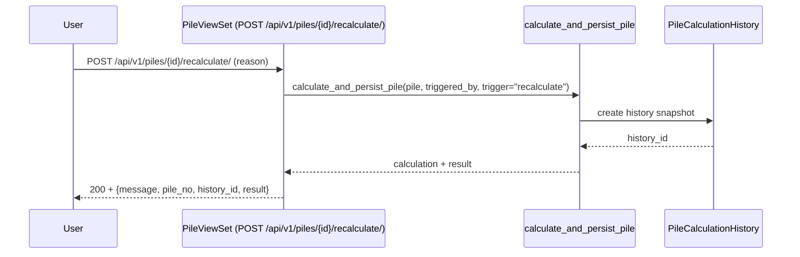

**Notes**
- `tests/test_api.py` validates history trigger, reason, input snapshot and result snapshot.

---

### 9) Pile Breakdown

**Purpose**
Return full engineering breakdown for a pile.

**Actors**
User, PileViewSet breakdown action, PileCalculator

**Preconditions**
Pile exists and is visible.

**Sequence Diagram**
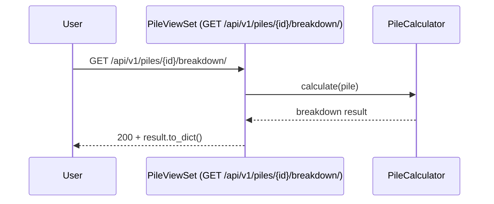

**Notes**
- Tests assert keys `steel.main_bars`, `steel.helix`, `steel.stiffeners` and `concrete`.

---

### 10) Pile Calculation History (immutable)

**Purpose**
Return paginated immutable calculation history for a pile.

**Actors**
User, PileViewSet calculation_history action, Serializer, Database

**Preconditions**
Pile exists and is visible.

**Sequence Diagram**
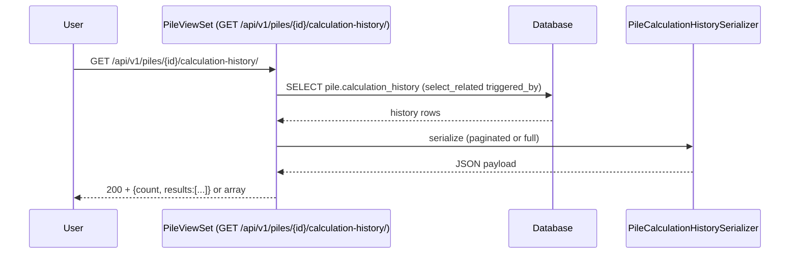

**Notes**
- Uses DRF pagination when applicable.

---

### 11) Bulk Create Piles (atomic)

**Purpose**
Create multiple piles with all-or-nothing rollback.

**Actors**
User, PileViewSet bulk_create action, PileCreateUpdateSerializer, Database

**Preconditions**
Payload must be a list.

**Sequence Diagram**
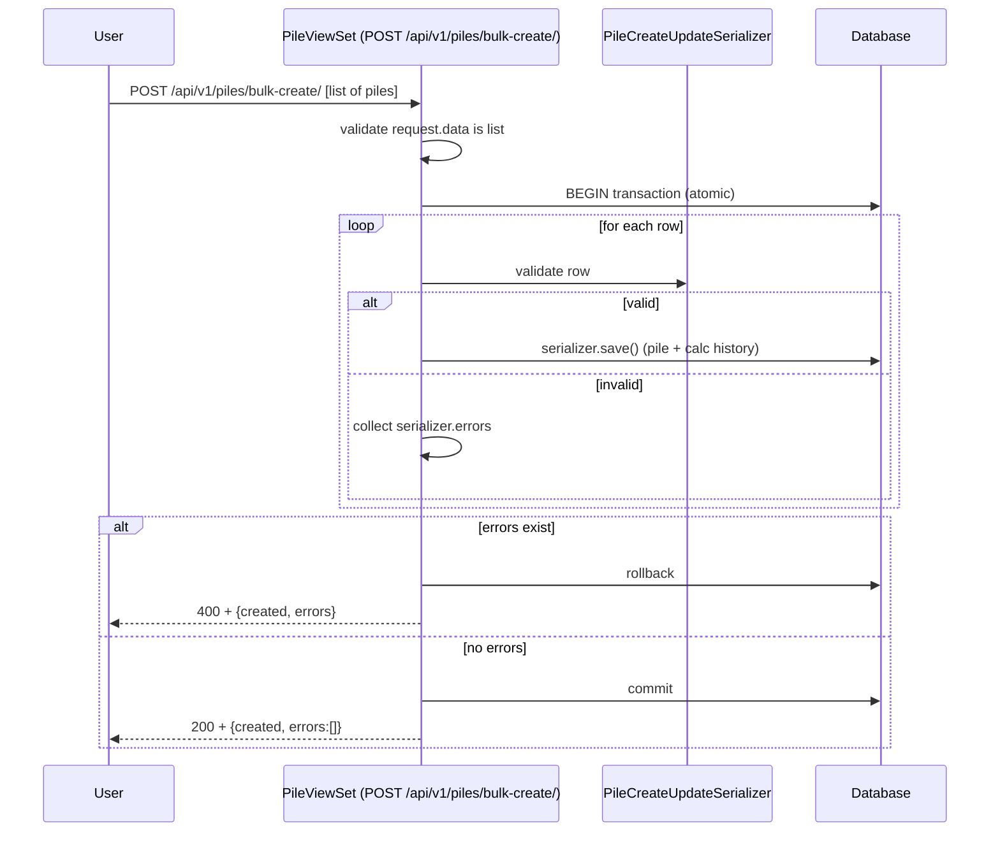

**Notes**
- Tests assert 400 when payload is not list and when row has validation errors.

---

### 12) CSV Import (atomic + optional dry-run)

**Purpose**
Import piles from CSV with row-level errors and dry-run mode.

**Actors**
User, PileViewSet import_csv action, Serializer, Database

**Preconditions**
CSV file uploaded as multipart field `file`.

**Sequence Diagram**
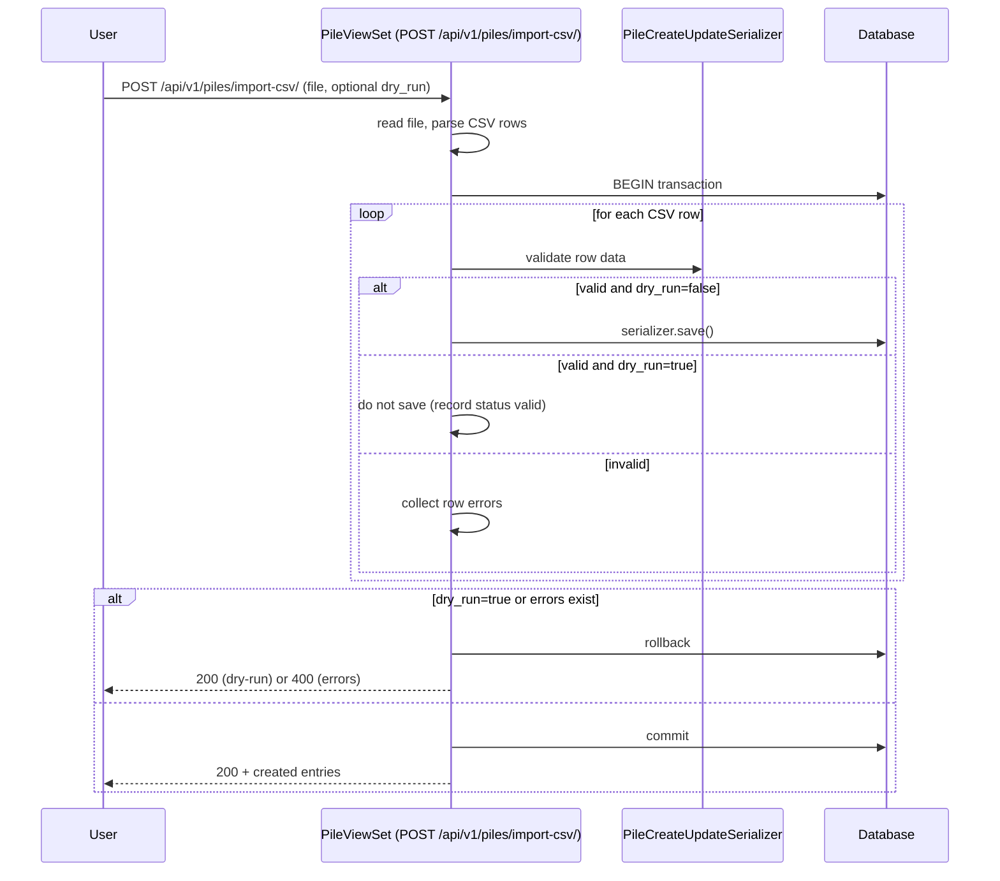

**Notes**
- `tests/test_api.py` validates dry_run success returns created rows with status `valid` and does not persist.

---

### 13) Evidence Upload

**Purpose**
Upload evidence and store metadata + hash.

**Actors**
User, EvidenceItemViewSet upload action, EvidenceUploadSerializer, evidence_service, EvidenceItem model, Database

**Preconditions**
User is authenticated.

**Sequence Diagram**
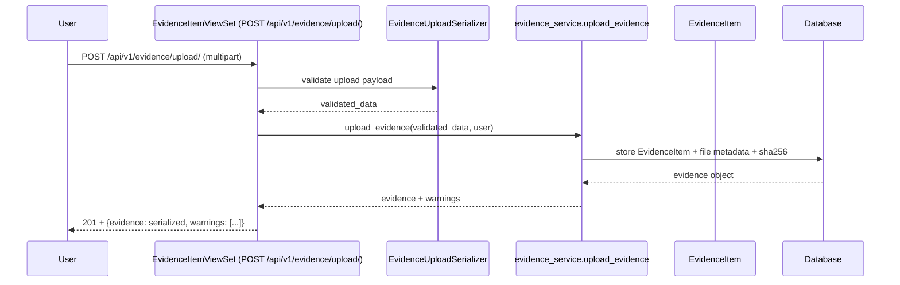

**Notes**
- Evidence upload action is implemented in `apps/evidence/views.py`.

---

### 14) Evidence Verify

**Purpose**
Verify an uploaded evidence item by updating `verification_status`.

**Actors**
User, EvidenceItemViewSet.verify action, EvidenceVerifySerializer, evidence_service

**Preconditions**
Evidence item exists and is visible.

**Sequence Diagram**
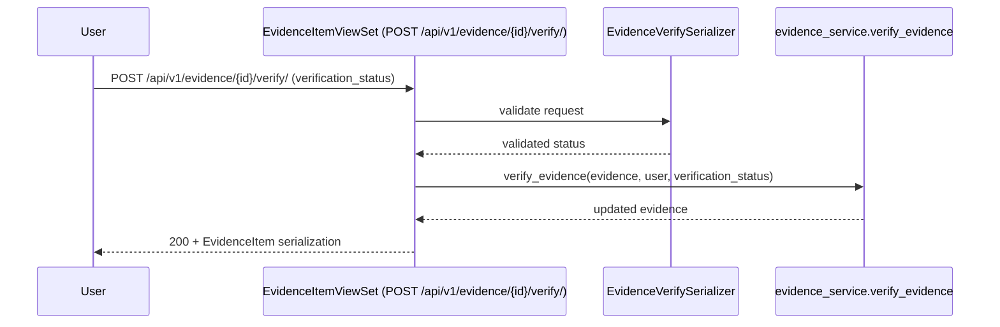

**Notes**
- Verification status transitions enforced in service (not shown here).

---

### 15) Evidence Link to Execution Record Version

**Purpose**
Create an immutable link from evidence to an `ExecutionRecordVersion` snapshot.

**Actors**
User, EvidenceItemViewSet.link action, EvidenceLinkRequestSerializer, evidence_service

**Preconditions**
ExecutionRecordVersion id is valid.

**Sequence Diagram**
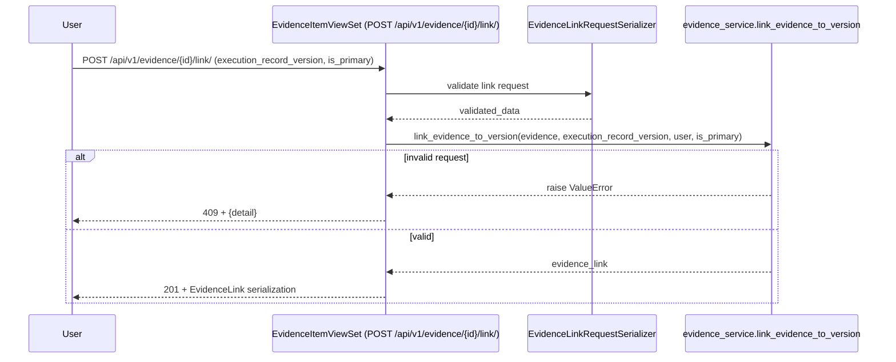

**Notes**
- 409 is explicitly mapped for ValueError.

---

### 16) Verification: Run verification checks

**Purpose**
Run deterministic rule-based checks against an immutable execution record version and return variance flags.

**Actors**
User, RunVerificationChecksAPIView, ExecutionRecordVersion model, verification_service, VarianceFlag model

**Preconditions**
ExecutionRecordVersion exists.

**Sequence Diagram**
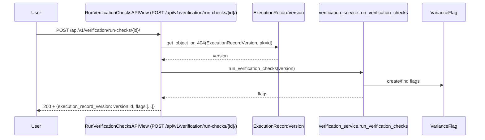

**Notes**
- Schema description states idempotency and non-duplication semantics.

---

### 17) Verification: Transition variance flag (acknowledge/resolve/waive)

**Purpose**
Change variance flag state with an optional comment.

**Actors**
User, VarianceFlagViewSet, Transition serializer, verification services

**Preconditions**
Flag exists and is visible.

**Sequence Diagram**
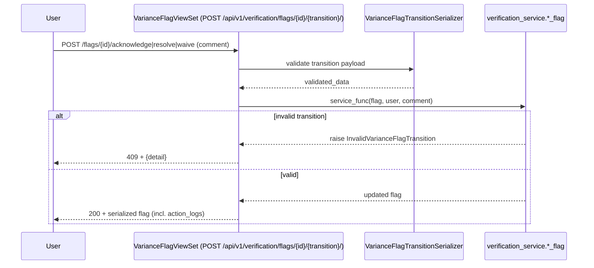

**Notes**
- 409 is explicitly mapped in `_transition()`.

---

### 18) Execution: Submit driving record (immutable snapshot)

**Purpose**
Submit a mutable driving record and create an immutable version.

**Actors**
User, PileDrivingRecordViewSet, submission service, state machine, ExecutionRecordVersion

**Preconditions**
Driving record is in DRAFT or RETURNED_FOR_CORRECTION (workflow-dependent).

**Sequence Diagram**
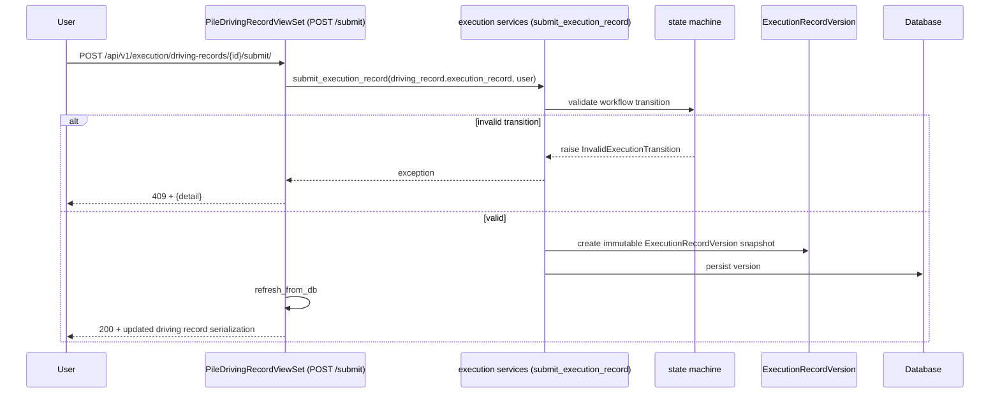

**Notes**
- Implemented in `apps/execution/views.py::submit()`.

---

### 19) Execution: Revise returned record (create new version)

**Purpose**
Apply contractor corrections for returned records and create a new immutable version.

**Actors**
User, PileDrivingRecordViewSet, create_revision_from_record, ExecutionRecordVersion

**Preconditions**
Driving record is mutable and in a returned workflow stage.

**Sequence Diagram**
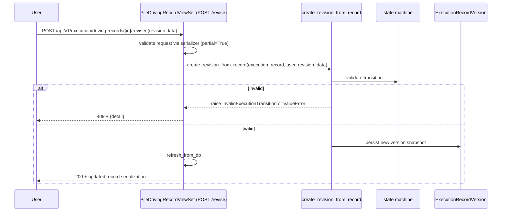

---

## Notes on recommendations section

This repository snapshot does not provide explicit additional recommendation workflows beyond what’s implemented in code and described in docstrings/schema.

